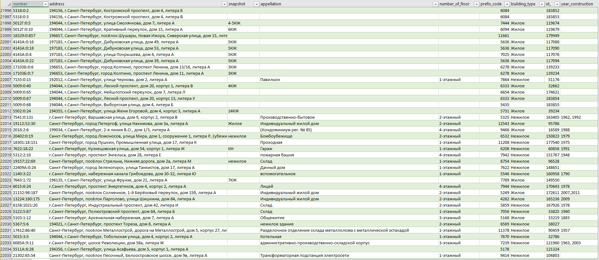
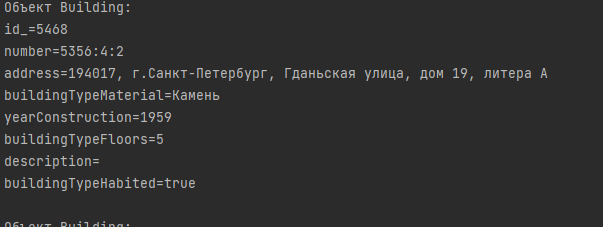
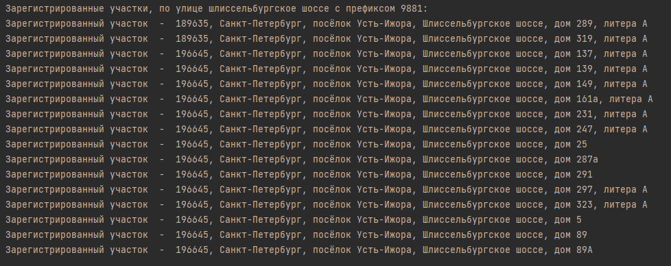
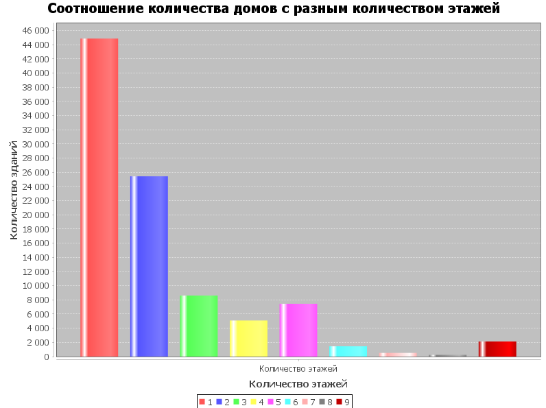

# Java Project по зданиям СПБ

## 1 Постройте график. По Х дома с определенным количеством этажей(1, 2, 3, 4, 5 и тд) по Y количество таких домов.
## 2 Найдите зарегистрированные участки, по улице шлиссельбургское шоссе с префиксом 9881.
## 3 Найдите «университеты», выше 5 этажа с известным годом постройки и вычислите средний prefix_code

## Исходные данные

## Main
##Здесь произходит обработка данных

## Результат

По окончании этого этапа мы имеем следующее:

## Создание базы данных SQL

Подключаем базу данных и создание структуры данных

Вывод:

По завершении этого этапа имеем гистограмму:

## Итог

Была выполена работа по созданию программы посартировке домов по высоте и численности.
